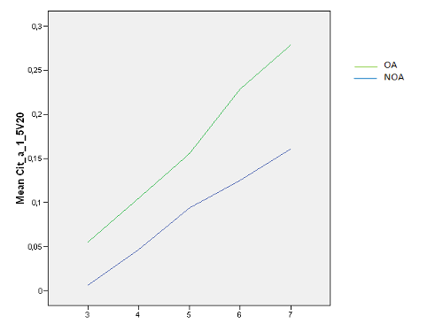

# A Figure-to-Caption Generative Modeling Framework with RLHF


[[`Paper`]()]  [[`BibTex`]()]


RLHF provides a robust benchmark dataset for facilitating the study and application of Reinforcement Learning with Human Feedback (RLHF) in the domain of scientific figures generation. 


 

## RLHF Dataset

RLHF dataset performance in comparsion to baselines

| Model            | Parameters | Rouge-L | Bleu   | Meteor |
|------------------|------------|---------|--------|--------|
| BLIP             | 0.25B      | 0.130   | 0.014  | 0.132  |
| Ours-BLIP-RLHF   | 0.25B      | 0.152   | 0.019  | 0.145  |


## Training (Using BLIP as the sample model for the RLHF dataset)

Downloading and unzipping the dataset and downloading dependencies 

```shell
pip install --upgrade pip
git clone https://github.com/TODO/RLHF.git
cd RLHF
pip install -r requirements.txt
wget https://figshare.com/ndownloader/files/40317607 -O dataset.zip
unzip dataset.zip
./cp.sh
```


<!-- Using VIT-gpt2 as a sample model for training using Huggingface's dataset library and its seq2seqTrainer for a simple training on our dataset, it will save the model under the directory model, and wills save checkpoints for every epoch. Modify the variable training_args if user wants to have different training arguments. If User desire to use other models using Huggingface's Trainer class, modify the model specification under train_vit_gpt2.py
```shell
python train_vit_gpt2.py

``` -->

<!-- Another way for Training. -->
Here we are using BLIP as a sample model for training using Pytorch's native DataLoader library combined with Huggingface's dataset class. It also has a training loop. User can provide arguments for their desired functionality as shown in the script below. To change the the number of epochs and learning rate, modify config variable in train_blip.py.
```shell
python train_blip.py --f16 --output_dir output

```

## Inference
（after downloading and setting up the dataset) To predict a scientific caption from an scientific image, and if the user desire to use other models for inference, please make the modification in inference.py. Below, we will provide a pre-trained BLIP model trained on this benchmark dataset and make simple inference using the model provided.
```shell 
./pred.sh
cd BLIP
```
Now use this [link](https://drive.google.com/file/d/1FZh95Xeyt3RlaYs_TeeiiSPwYvAuGogQ/view?usp=share_link) to download our model, and place it under directory BLIP, and use the following script to do an inference on the sample.png
```shell
python inference.py sample.png
```
If running on a CPU, the expected result is *the results of comparing oa and noa in terms of mean of error.* (on seed 42).

 


## Creating your own metadata (Specific to Huggingface's datasets library)
In order to use huggingface's dataset library to include other metadata, a metadata.jsonl file for each of the split containing contents shown below must be created, we have created a default one for three splits containing the human feedback caption using the helpfulness score.
```


{"file_name": filename, "metadata1":data, "metadata2":data}
...

Here are some contents from the example metadata.jsonl
{"file_name": "1001.0036v1-Figure9-1.png", "RLHF_caption": "[BAD] stimulated barrel cortex neuron isi distribution and time-dependent complexity and entropies . ( a ) isi distribution and % confidence bounds . ( b ) first panel : firing probability as a function of time since stimulus presentation . second panel : time-dependent complexity . third panel : time-dependent entropies . ( c ) the stimulus driven entropy ( maximum of 0.02 bits/msec ) is low because the number of spikes per stimulus ( \u2248 0.1 \u2212 0.2 ) is very low and hence the stimulus does not supply much information ."}
{"file_name": "1001.0317v2-Figure2-1.png", "RLHF_caption": "[BAD] variable -d initial probe distribution used for cfo runs reported here ."}
...
```

## Model card
Please see the [model card](model_card.md) for details.


## Citing RLHF

If you find this repository useful, please consider giving a star :star: and citation

```

```
